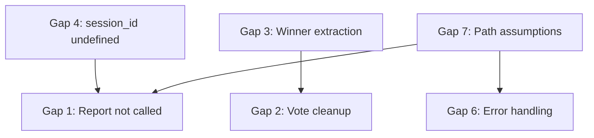

# MAKER Framework Gap Analysis

**Date**: 2025-12-01
**Status**: Comprehensive review of workflow integrity

## Executive Summary

The MAKER framework has 7 critical gaps that prevent correct execution. This document identifies all gaps and proposes fixes.

---

## Critical Workflow Gaps (Breaks Execution)

### Gap 1: Report Generation Not Implemented
**Location**: `commands/maker.md` Step 5
**Problem**: Shows a report template but never calls the actual report command
**Current State**:
```markdown
MAKER Execution Report
======================
Session: [session_id]
...
```
**Expected State**:
```bash
~/.claude/hooks/maker_state.py "$session_id" report
```
**Impact**: Users never get actual execution metrics

---

### Gap 2: Vote Cleanup Missing
**Location**: `commands/maker.md` Step 3B (Critical Steps)
**Problem**: After applying winner, votes are never cleared
**Current State**: No cleanup instruction after "apply action, proceed"
**Expected State**:
```bash
~/.claude/hooks/check_winner.py "$VOTE_DIR" --clear
```
**Impact**: Old votes pollute future steps with same step_id

---

### Gap 3: Winner Extraction Not Documented
**Location**: `commands/maker.md` Step 3B.2
**Problem**: Says "Extract winner from feedback" but doesn't show how
**Current State**: `✅ MAKER VOTE DECIDED... Winner: ${winner}`
**Expected State**:
```bash
# Hook feedback contains: Winner: {"step_id":"step_2","action":"...","result":"..."}
# Extract the JSON after "Winner: "
winner_json=$(echo "$hook_feedback" | grep -oP 'Winner: \K.*')
```
**Impact**: Users don't know how to parse the winner JSON

---

### Gap 4: Session ID Undefined
**Location**: `commands/maker.md` Step 1, multiple locations
**Problem**: Uses `$session_id` without explaining where it comes from
**Current State**: `~/.claude/hooks/maker_state.py "$session_id" init ...`
**Expected Context**: Session ID is available in Claude Code's environment
**Fix Needed**: Document that `$session_id` is a Claude Code built-in variable

---

### Gap 5: State Update Transparency
**Location**: `commands/maker.md` Step 3B
**Problem**: Unclear that hooks automatically update state
**Current State**: No mention that `maker-post-task.sh` calls `maker_state.py update`
**Expected State**: Document that hooks handle state updates automatically
**Impact**: Users may try to manually update state, causing conflicts

---

## User Experience Gaps (Confusing but Functional)

### Gap 6: No Error Handling Guidance
**Location**: `commands/maker.md` Step 1
**Problem**: If state initialization fails, no recovery guidance
**Scenarios**:
- Hook script not found at `~/.claude/hooks/`
- Invalid k value provided
- JSON parse errors in state file
**Fix Needed**: Add troubleshooting section

---

### Gap 7: Path Assumptions Not Validated
**Location**: Multiple locations
**Problem**: Assumes `~/.claude/hooks/` exists and is executable
**Current State**: Direct calls to `~/.claude/hooks/maker_state.py`
**Expected State**: Check if path exists first, provide clear error if not
**Impact**: Silent failures if hooks aren't installed correctly

---

## Gap Details with File References

| Gap # | File | Line | Severity | Type |
|-------|------|------|----------|------|
| 1 | `commands/maker.md` | 143-165 | CRITICAL | Missing implementation |
| 2 | `commands/maker.md` | 120-123 | HIGH | Missing cleanup step |
| 3 | `commands/maker.md` | 120-121 | HIGH | Missing documentation |
| 4 | `commands/maker.md` | 39-41 | MEDIUM | Undefined variable |
| 5 | `commands/maker.md` | 120-130 | MEDIUM | Unclear automation |
| 6 | `commands/maker.md` | 36-42 | LOW | No error handling |
| 7 | `commands/maker.md` | 41 | LOW | No validation |

---

## Hook System Gaps

### Gap 8: No `$session_id` Documentation in Hook
**Location**: `hooks/maker-post-task.sh`
**Problem**: Uses `$session_id` from JSON but doesn't validate it
**Line**: 15, 117-122, 148-161
**Fix**: Add validation and error message if session_id is empty

---

## Proposed Fixes

### Fix Priority Matrix

```
High Priority (breaks workflow):
  ✓ Gap 1: Add actual report command
  ✓ Gap 2: Add vote cleanup step
  ✓ Gap 3: Document winner extraction

Medium Priority (confusing):
  ✓ Gap 4: Document session_id source
  ✓ Gap 5: Clarify automatic state updates

Low Priority (edge cases):
  ✓ Gap 6: Add error handling guide
  ✓ Gap 7: Add path validation
  ✓ Gap 8: Validate session_id in hooks
```

---

## Dependencies Between Gaps



Gap 4 must be fixed before Gap 1 (can't call report without session_id)
Gap 3 should be fixed before Gap 2 (need to extract winner before cleanup)

---

## Testing Checklist (After Fixes)

- [ ] Initialize state with valid k value
- [ ] Execute regular step (non-critical)
- [ ] Execute critical step with voting
- [ ] Verify vote cleanup after winner decided
- [ ] Generate final report successfully
- [ ] Handle error: missing hook scripts
- [ ] Handle error: invalid k value
- [ ] Handle error: corrupted state file

---

## Next Steps

1. Fix all gaps in `commands/maker.md`
2. Add validation to `hooks/maker-post-task.sh`
3. Create troubleshooting guide
4. Test end-to-end workflow
5. Update documentation with examples
